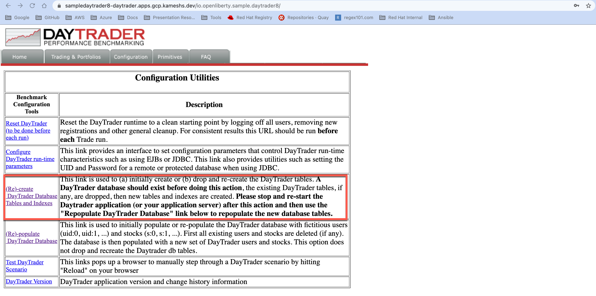
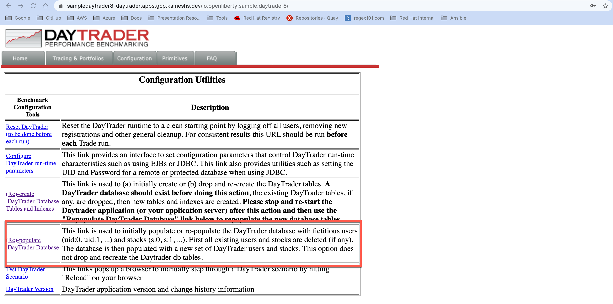

= Day Trader

The heritage Stock trading application based on J2EE.

== Pre-requisites

* https://try.openshift.com[OpenShift 4 Cluster]
* https://www.redhat.com/en/resources/amq-streams-datasheet[Red Hat AMQ Streams]

== Prepare Cluster

Ensure the following operator is installed in cluster:

-https://www.redhat.com/en/blog/getting-started-red-hat-amq-streams-operator[Red Hat AMQ Streams]

[NOTE]: In OpenShift the operators can be installed via Operator Hub integration from Administrator console.

== Clone the sources

[source,bash]
----
git clone -b sko-demo https://github.com/kameshsampath/sample.daytrader8
----

We will refer to the cloned project sources folder as `$PROJECT_HOME`.

[source,bash]
----
cd $PROJECT_HOME
----

== Deploy Databases

On clusters where heritage application `sampledaytrader` is deployed, deployed MySQL:

[source,shell script]
----
oc apply -k k8s/db/prod

----

== Deploy Application

[source,shell script]
----
oc apply -k k8s/sampledaytrader8/prod
----

[source,shell script]
----
export DAYTRADER_ROUTE="https://$(oc get route daytrader -ojsonpath='{.spec.host}')"
----

== Create and Populate the DB tables

Create the application DB tables,

(OR)

[source,shell script]
----
curl -X GET "$DAYTRADER_ROUTE/io.openliberty.sample.daytrader8/config?action=buildDBTables"
----

[source,shell script]
----
oc scale --replicas=0 deploy/sampledaytrader8
oc scale --replicas=1 deploy/sampledaytrader8
----

Populate the tables with sample data,

(OR)

[source,shell script]
----
curl -X GET "$DAYTRADER_ROUTE/io.openliberty.sample.daytrader8/config?action=buildDB"
----

== Deploy Kafka

[source,shell script]
----
oc apply -k k8s/kafka/prod
----

=== Deploy Debezium KafkaConnect and MySQL KafkaConnector

[source,shell script]
----
oc apply -k k8s/debezium/prod
----

*NOTE*: This will take few mins for the Connector to be activated

Wait for the KafkaConnect `daytrader-debezium-connect` pod to be running:

[source,shell script]
----
watch oc get pods -n daytrader -l=strimzi.io/name=daytrader-debezium-connect
----

A successful KafkaConnect should show "Ready" to be "True":

[source,shell script]
----
oc get KafkaConnect  -n daytrader daytrader-debezium -ojsonpath='{.status.conditions[?(@.type=="Ready")].status}'
----

*NOTE*: It will take few seconds for the KafkaConnector to be reconciled. Wait for few mins before you run the following commands to check the status.

Check the status of the `mysql-daytrader-connector` to be ready:

[source,shell script]
----
oc get KafkaConnector mysql-daytrader-connector -ojsonpath='{.status.conditions[?(@.type=="Ready")].status}'
----

=== List Kafka Topics

[source,shell script]
----
./scripts/kafka-list-topics daytrader
----

Will list the following topics:

[source,text]
----
__consumer_offsets
connect-cluster-configs
connect-cluster-offsets
connect-cluster-status
openshift
openshift.traderdb.accountejb
openshift.traderdb.accountprofileejb
openshift.traderdb.holdingejb
openshift.traderdb.keygenejb
openshift.traderdb.orderejb
openshift.traderdb.outboxevent
openshift.traderdb.quoteejb
schema-changes.traderdb
----

NOTE: If you don't see all the topics as listed, try restarting the debezium connector pod

[source,shell script]
----
oc scale --replicas=0 deploy/daytrader-debezium-connect
oc scale --replicas=1 deploy/daytrader-debezium-connect
----

== Access the Application

[source,shell script]
----
open $DAYTRADER_ROUTE/io.openliberty.sample.daytrader8/
----

== Development

=== Building Debezium MySql Connector

[source,shell script]
----
cd k8s/debezium
docker build --no-cache <container-registry>/debezium-connect
docker push <container-registry>/debezium-connect
----

*NOTE*: Be sure to update the k8s/debezium/debezium-connect.yaml with an image from the build

=== Image Streams

[source,shell script]
----
oc create -f https://raw.githubusercontent.com/OpenLiberty/open-liberty-s2i/master/imagestreams/openliberty-ubi-min.json
----

=== Deploy Application

[source,shell script]
----
oc new-app openliberty:~https://github.com/kameshsampath/sample.daytrader8#sko-demo -n daytrader-dev
----

[source,shell script]
----
oc create route edge --service=sampledaytrader8 --port=9080 daytrader
export DAYTRADER_ROUTE="https://$(oc get route daytrader -ojsonpath='{.spec.host}')"
----